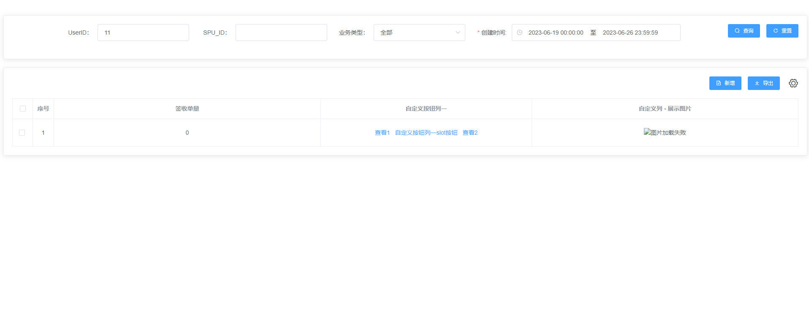
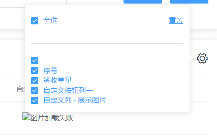

##  `X-Pages` 是基于Vue2、ElementUI的面向配置的CRUD，快速开发CRUD功能，入门简单，让你可以快速完成搬砖任务，更多的时间划水吹逼。
### 特殊说明，使用该组件的项目须安装 下面的npm包
```bash
    "element-ui": "^2.x",
    "lodash": "",
    "vue": "^2.x",
    "vue-template-compiler": "^2.x",
    "dayjs": ""
```

### 安装
```bash
 npm i x-pages
```

### 使用
``` javascript
<template>
  <div>
    <x-page ref="blackBoxPage" :config="config" @eventHooks="eventHooks" @selection-change="handleSelectionChange">
      <template #slotBtn1="{ row }">
        <el-button type="text" @click="slotBtn(row)">
          自定义按钮列一slot按钮
        </el-button>
      </template>
      <template #img_columns="{ row }">
        <div>
          
        </div>
      </template>
    </x-page>

  </div>
</template>

<script>
import { XPage } from "x-pages";
import _ from "lodash"
import dayjs from "dayjs"

export default {
  name: 'HelloWorld',
  components: {
    XPage
  },
  data() {
    return {
      config: {
        form: [
          { label: 'UserID：', prop: 'userId', defaultValue: '11', formType: 'el-input' },
          { label: 'SPU_ID：', prop: 'spuId', defaultValue: '', formType: 'el-input' },
          {
            label: '业务类型：',
            prop: 'checkBizType',
            defaultValue: 'ALL',
            formType: 'el-select',
            options: 'bizTypeOptions',
            showAllOpt: true,
            allOptionValue: 'ALL', // 是否更换 '全部' 的选择值
          },
          {
            formType: 'x-date-range',
            // type: 'daterange',
            prop: 'modifyTimeStartAndEnd',
            defaultValue: [
              dayjs().subtract(7, 'day').format('YYYY-MM-DD 00:00:00'),
              dayjs().format('YYYY-MM-DD 23:59:59'),
            ],
            label: '创建时间:',
            unlinkPanels: true,
            rangeSeparator: '至',
            startPlaceholder: '开始日期',
            endPlaceholder: '结束日期',
            valueFormat: 'yyyy-MM-dd HH:mm:ss',
            maxLimit: 30,
            required: true,
          },
        ],
        formConfig: {
          inline: true,
          labelWidth: '100px',
        }, // 透传 el-form 的属性
        optionsData: {
          bizTypeOptions: [
            { value: 3, label: '个人寄存' },
            { value: 5, label: '企业寄存' },
          ],

          statusOptions: [
            { value: 0, label: '启用中' },
            { value: 1, label: '停用' },
          ],
        }, // (可选)，下拉枚举列表，

        table: {
          showFilter: true,
        },

        columns: [
          { type: 'selection', fixed: 'left' },
          { type: 'index', label: '序号', fixed: 'left', width: 50 },
          { prop: 'signedQuantity', label: '签收单量', defaultValue: '0' },
          {
            slotName: 'btn_1',
            label: '自定义按钮列一',
            width: 500,
            btnGroup: [
              {
                text: '查看1',
                events: 'test1',
                type: 'text',
              },
              {
                slotName: 'slotBtn1',
                type: 'text',
              },
              {
                text: '查看2',
                events: 'test2',
                type: 'text',
              },
            ],
          },
          {
            slotName: 'img_columns',
            label: '自定义列 - 展示图片',
          },
        ],

        events: {
          search: {
            url: '/pink/admin/check/config/v1/page',
            method: 'post', // (可选)，没有该字段， 默认是get 请求
            // immediate: true, // (可选)，没有该字段， 默认进入页面不请求列表数据
            isValideForm: true, // 默认false, 不校验搜索表单
            mockData: [
              {
                id: 1,
                url: '',
              },
            ], // mock数据， 上线前必须去掉，，不然列表返回的始终是mockData
            transformRequset(data) {
              console.log('--------------\n\n\n', data)
              const { modifyTimeStartAndEnd, ...restData } = data
              const startTime = _.get(modifyTimeStartAndEnd, '[0]', '')
              const endTime = _.get(modifyTimeStartAndEnd, '1', '')
              // data.category = data.category.join(',')
              return {
                ...restData,
                startTime,
                endTime,
              }// 必须返回一个对象
            }, // (可选)
            responseListPath: 'contents', // (可选)，表示取 data.contents ;  没有该字段， 默认是data
            responseTotalPath: 'total', // (可选)，表示取 data.total ;  没有该字段， 默认是data.total
            transformResponse(data) {
              const temp = data.map(item => {
                const { status } = item
                const statusMap = ['失效', '生效']
                return {
                  ...item,
                  statusStr: statusMap[status],
                }
              })
              return temp
            }, // (可选)
          },
          reset: true, // 搜索条件 重置 按钮
          add: true, // 表头按钮  新增 按钮位置 点击会触发 add 事件
          //  表头 导入 按钮操作

          //  表头 导出按钮 操作
          export: {
            url: '',
            method: 'get', // (可选)，没有该字段， 默认是get 请求
            type: 'leadTime',
          },
        },
      },
    }
  },
  methods: {
    // 自定义事件处理
    eventHooks({ event, btn, data, formData }) {
      // this.config.table.columns.btnGroup ,
      // btn 是该按钮的配置信息，
      // data 是table当前行的row 数据，
      // 如果btn 有 needFormData 属性，则返回 不带分页的搜索参数 formData
      console.log('---eventHooks----', event, btn, data, formData)
      if (!this[event]) return
      // 统一转发btn config 配置中事件，methods中需要有与btn events 同名的事件来处理自定义逻辑
      this[event]({ btn, data, formData })
    },
    queryLog(row) {
      this.logVisible = true
      console.log('---query---', row)
    },
    add({ data }) {
      console.log('add data', data)
    },
    slotBtn(row) {
      console.log('==slotBtn 自定义slot按钮==', row)
    },
    // 刷新列表逻辑
    refreshList() {
      this.$refs.blackBoxPage.initSearch()
    },

    handleSelectionChange(val) {
      console.log('-handleSelectionChange-', val)
      this.selectionList = val
    },
  },
}
</script>

<!-- Add "scoped" attribute to limit CSS to this component only -->
<style scoped>
h3 {
  margin: 40px 0 0;
}

ul {
  list-style-type: none;
  padding: 0;
}

li {
  display: inline-block;
  margin: 0 10px;
}

a {
  color: #42b983;
}
</style>


```

### 效果

